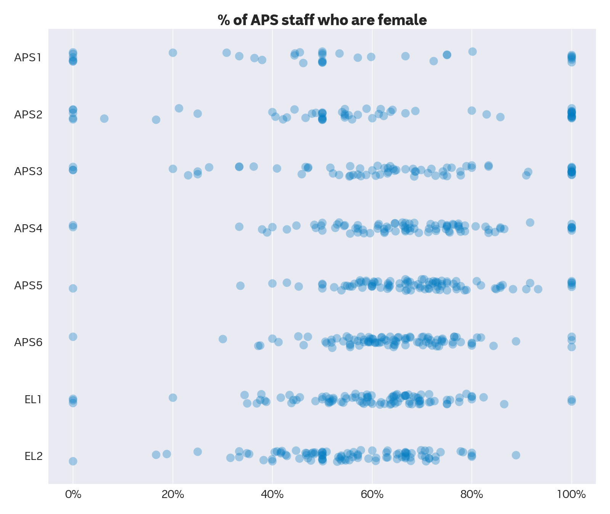
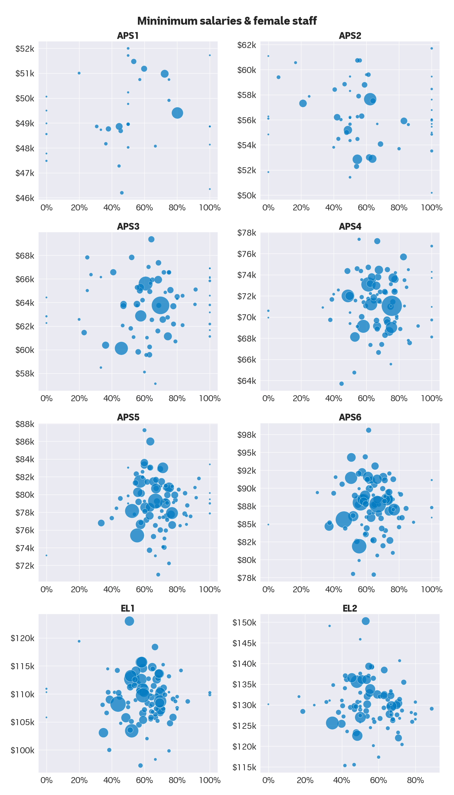

# Do 'feminised' government workplaces pay less?

(TL;DR: No.)

I've examined this question several times but it keeps popping up. So I'm publishing this analysis — and the relevant data — again for when it's next asked.

The Australian Public Service (APS) decentralised pay bargaining in the 1990s. In the years since, unions and some politicians said agencies with a higher proportion of female staff paid less than others. The Community and Public Sector Union repeated this argument in the lead-up to this year's APS enterprise agreement (EA) negotiations.

The Albanese government [says it is trying to reduce pay gaps between APS agencies](https://www.abc.net.au/news/2023-06-02/which-public-servants-will-receive-a-pay-boost/102420798). To aid this, the Australian Public Service Commission (APSC) collated and shared the salary ranges of 103 APS agencies. I've combined these data [with other APSC employment data](https://www.apsc.gov.au/employment-data/aps-employment-data-31-december-2022) to understand the associations between workforce gender splits and salaries. The two datasets I used — APS salaries and staff headcounts — were correct as of December 31, 2022.

## Examining the data

This analysis omits six agencies, because the APSC excludes these agencies from its staff headcounts (and I was too lazy to fetch their data myself). That leaves 97 agencies — close to a census of APS staff. The excluded agencies are:

* Australian Office of Financial Management
* Commonwealth Grants Commission
* Domestic, Family & Sexual Violence Commission
* IP Australia
* Royal Australian Mint

I also exclude senior executive service (SES) officers, as most are employed on individual contracts. Also, graduate staff are categorised as APS3 officers — the level at which almost all of them are employed.

Let's look at the data we're working with.

The plot below shows almost half (44.6%) of all non-SES staff are employed as APS6s or EL1s:

It's also clear that the APS is a largely feminised workforce, both overall and at each job level. 60.7% of the staff included in this analysis are women. Some agencies are extremely feminine at some levels; others are extremely masculine. But in general, the "femininity" of the 97 workplaces are normally distributed. (Each circle in the plot below represents one agency's employee cohort at that level.)

Combining the salary and staffing data allows us to examine any correlations — and to understand whether feminised workplaces do, in fact, pay less.

I use minimum salaries in this analysis, as I believe they more closely reflect the salaries of most staff. Minimum salaries are also more likely to represent the alternatives for staff who want to leave a low-paying workplace.

The plots below show no obvious association between agencies with many women (X-axis) and salaries (Y-axis). (The circle sizes reflect the number of staff in that agency at that level.)

(You can access [the dataset that I prepared here](./data/apsGenderAnalysis.csv).)

## Calculating correlation

A visual inspection of the plots above is enough to answer the original question: no, feminised workplaces are not paid less.

However, we'll measure the correlation (the **R squared** value) more precisely for the hell of it.

These are the results of linear regressions at each job level, using the percentage of staff who are women to predict an agency's salary. I tested both minimum and maximum salaries:

### **Regression results**

| job level | min. salary | max. salary |
| --- | --- | --- |
| APS1 | 0.8% | 0.1% |
| APS2 | 1.0% | 1.8% |
| APS3 | 1.2% | 0.0% |
| APS4 | 0.8% | 0.0% |
| APS5 | 0.5% | 0.1% |
| APS6 | 0.0% | 1.5% |
| EL1 | 0.1% | 0.0% |
| EL2 | 1.2% | 0.4% |

In short, these are junk results. There's no correlation between how feminine APS agencies are and the salaries they pay.

However, this approach has a flaw: it treats all agencies equally. So massive agencies, like Services Australia, carry the same weight as tiny ones, like Screen Australia.

We can get around this by applying weights to our regression, reflecting agency sizes. And when we do this, we get a couple of results that look at least a little like correlation:

### **Weighted regression results**

| job level | min. salary | max. salary |
| --- | --- | --- |
| APS1 | -2.5% | -41.7% |
| APS2 | -0.7% | -15.5% |
| APS3 | -40.0% | -29.2% |
| APS4 | -2.1% | -10.2% |
| APS5 | -7.0% | -4.1% |
| APS6 | -5.6% | -4.1% |
| EL1 | -13.4% | -3.1% |
| EL2 | -12.1% | -5.4% |

Feminine agencies pay lower maximum salaries to APS1 officers, and lower minimum salaries to APS3 officers.

Nonetheless, the correlations are generally weak — especially for the levels at which most staff are employed.

So no, feminised government workplaces don't pay less. In any event, this question may eventually become redundant, with the government [chipping away at the "pay fragmentation"](https://www.abc.net.au/news/2023-05-30/public-service-pay-gaps-to-be-fixed-federal-government/102410008) caused by agency-based bargaining.

(You can access the [Python script I used for this analysis here](./data/analyse_data.ipynb).)